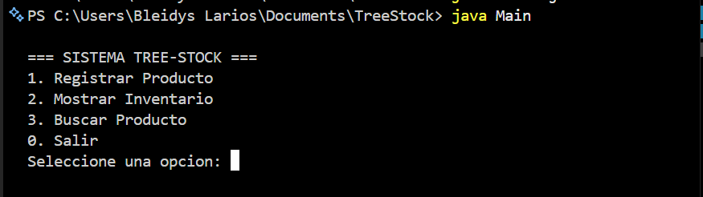
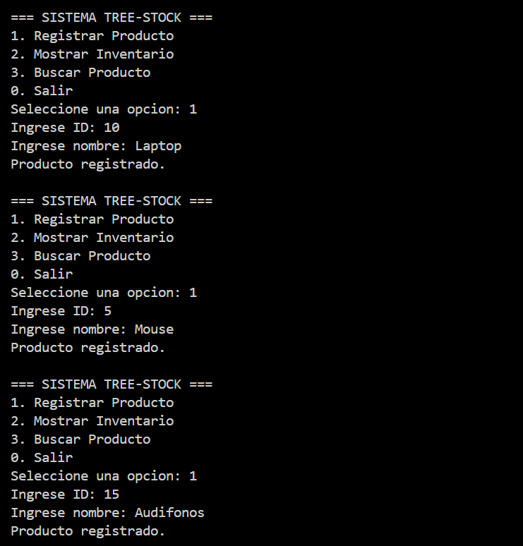
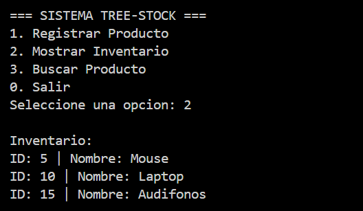
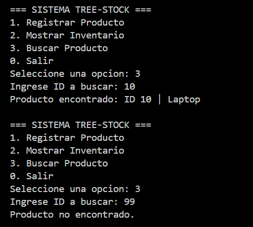

# EA3 - Tree-Stock

Sistema de inventario implementado con un **Árbol Binario de Búsqueda (ABB)** en Java.

---

## Objetivo

Aplicar el concepto de árbol binario de búsqueda para gestionar un inventario de productos, permitiendo registrar, listar y buscar productos de forma eficiente mediante el uso de **recursividad y punteros**.

---

## ¿Qué es un Árbol Binario de Búsqueda?

Un Árbol Binario de Búsqueda (ABB) es una estructura de datos donde:

- Cada nodo contiene un valor (en este caso, el ID del producto)
- Los valores menores se ubican en el subárbol izquierdo
- Los valores mayores se ubican en el subárbol derecho


---

## Uso de la recursividad

La recursividad es clave en este sistema:

- **Insertar:** el método se llama a sí mismo hasta encontrar la posición correcta
- **Recorrido inorden:** visita los nodos en orden (izquierda → raíz → derecha), mostrando los productos ordenados
- **Buscar:** compara el ID y continúa recursivamente hasta encontrar el producto o determinar que no existe

---

## Estructura del proyecto

```
EA3-TreeStock/
├── Producto.java          # Nodo del árbol (datos + punteros)
├── ArbolInventario.java   # Lógica del árbol
├── Main.java              # Menú interactivo
├── capturas/
│   ├── cap1-menu.png
│   ├── cap2-registro.png
│   ├── cap3-inventario.png
│   └── cap4-busqueda.png
└── README.md
```

---

## Funcionalidades

- Registrar productos (ID y nombre)
- Mostrar inventario ordenado (recorrido inorden)
- Buscar productos por ID
- Menú interactivo en consola

---

## Instrucciones de ejecución

### Pasos

1. Compilar:

```bash
javac Producto.java ArbolInventario.java Main.java
```

2. Ejecutar:

```bash
java Main
```

---

## Evidencias de ejecución

### Menú principal


### Registro de productos


### Inventario ordenado


### Búsqueda de producto


---

## Video de sustentación

Enlace: [Ver video de sustentación](https://youtu.be/XXhygfKwueM?si=n6O3YtRs0rG0pst1)

---

## Autor

**Nombre:** Bleidys Paola Larios Torregrosa  